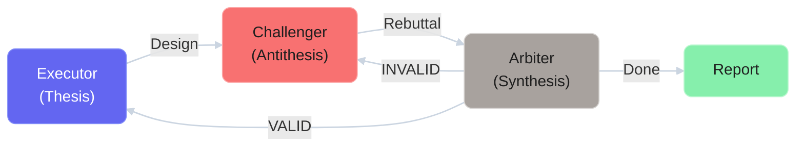
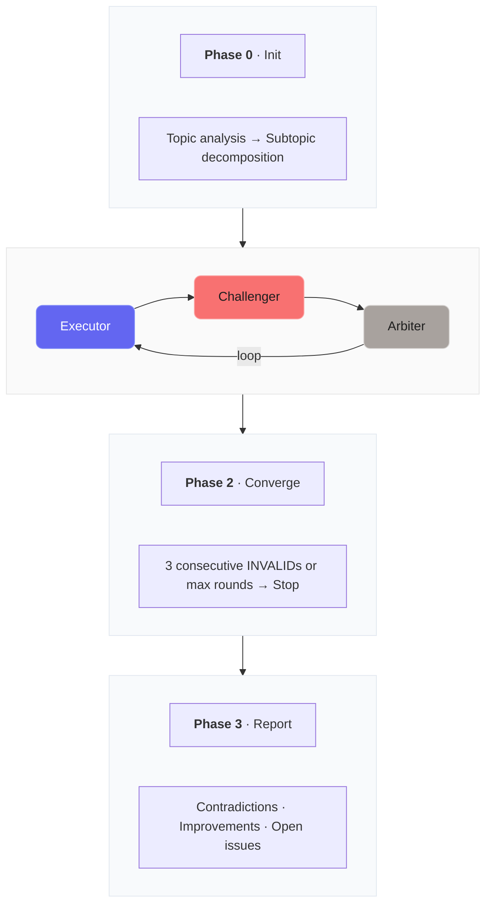

# Multi-Agent Adversarial Verification

> **[한국어](README.md)** | English


A multi-agent orchestration system that verifies AI-generated designs through dialectical structure (Thesis-Antithesis-Synthesis).

## What is this?

When you ask AI to "design this," you get a plausible answer. But **how do you know it's actually good?**

This system pits 3 AI agents with different roles against each other in structured debate, systematically uncovering design flaws:



The key is **structurally preventing derailment**. Rules block common debate pitfalls — topic shifting, circular reasoning, and unfounded acceptance — exposing every weak point that a solo designer would gloss over with "this should work."

## Why do you need this?

In an era where AI writes code fast, **human value is shifting from "writing quickly" to "judging correctly."** This system helps you spend AI-saved time not on producing *more*, but on producing *better*.

### Real Verification Results

| Experiment | Date | Models | Rounds | Contradictions | VALID Rate |
|-----------|------|--------|--------|----------------|------------|
| RAG System Design | 04-06 | Claude x 3 | 21 | 47 | 98% |
| LED Video Sync | 04-07 | Claude x 3 | 7 | 42 | 81% |
| RAG Implementation | 04-08 | Claude / Codex / Gemini | 7 | 40 | 97.5% |
| RAG Deploy + Runtime | 04-09 | Claude / Codex / Gemini | 2 + 9 TC | 3 | 7/9 PASS |

> **From RAG verification:** Pipeline **redesigned 3 times**, core data structures **changed 7 times**, topic derailment **auto-detected and blocked** (including Executor Collapse detection)

## How It Works



## Installation

### As a Claude Code Plugin (Recommended)

```bash
# 1. Add marketplace
/plugin marketplace add cho1124/multi-agent-adversarial-verification

# 2. Install plugin
/plugin install adversarial-verify@adversarial-verification

# 3. Reload plugins
/reload-plugins
```

### Dependencies (Optional)

For the full 3-model setup:

```bash
# Challenger — Codex CLI + Plugin
npm install -g @openai/codex
/plugin marketplace add openai/codex-plugin-cc
/plugin install codex@openai-codex

# Arbiter — Gemini CLI
npm install -g @google/gemini-cli
gemini   # Sign in with Google in browser
```

Works **with Claude alone** (no Codex/Gemini required):

```bash
/adversarial-verify "topic" --challenger=claude --arbiter=claude
```

## Usage

```bash
# Default (Claude=Executor, Codex=Challenger, Gemini=Arbiter)
/adversarial-verify "real-time chat message storage strategy"

# Custom role assignment
/adversarial-verify "DB schema" --executor=codex --challenger=claude --arbiter=gemini

# Custom models (add adapters in models/ folder)
/adversarial-verify "API design" --challenger=ollama-llama --arbiter=claude

# v1 placebo (for comparison experiments)
/adversarial-verify "caching strategy" --v1

# Set max rounds
/adversarial-verify "security architecture" --rounds=20
```

## Custom Model Adapters

Add an adapter file to `plugins/adversarial-verify/models/` to use any model:

```markdown
---
id: ollama-llama
name: Ollama Llama 3.1
type: cli
command: "ollama run llama3.1"
---

# Invocation
echo "<prompt>" | ollama run llama3.1
```

Supported types: `session` (Claude direct), `cli` (terminal command), `api` (HTTP), `mcp` (MCP server)

Details: [Model Adapter Guide](plugins/adversarial-verify/models/README.md)

---

## Documentation

- **[Full Journey Summary](docs/SUMMARY.md)** — Complete record from design to verification to implementation to deployment

### Design

- **[System Design Document](docs/%EB%A9%80%ED%8B%B0%20%EC%97%90%EC%9D%B4%EC%A0%84%ED%8A%B8%20%EC%A0%81%EB%8C%80%EC%A0%81%20%EA%B2%80%EC%A6%9D%20%EC%8B%9C%EC%8A%A4%ED%85%9C%20%EC%84%A4%EA%B3%84.md)** — Theory, design principles, experiment results, meta-verification, remaining challenges

### Experiment Logs

- **[RAG System Verification (2026-04-06)](docs/experiments/2026-04-06-RAG-%EC%8B%9C%EC%8A%A4%ED%85%9C-%EA%B2%80%EC%A6%9D/)** — 3 subtopics, 21 rounds, 47 contradictions found, 98% VALID
  - [Chunk ID Stability](docs/experiments/2026-04-06-RAG-%EC%8B%9C%EC%8A%A4%ED%85%9C-%EA%B2%80%EC%A6%9D/improvements/01-%EC%B2%AD%ED%81%ACID-%EC%95%88%EC%A0%95%EC%84%B1.md) — 7 redesigns
  - [Citation Consistency](docs/experiments/2026-04-06-RAG-%EC%8B%9C%EC%8A%A4%ED%85%9C-%EA%B2%80%EC%A6%9D/improvements/02-%EC%9D%B8%EC%9A%A9-%EC%A0%95%ED%95%A9%EC%84%B1.md) — 3-stage span fallback + 2-stage IoU
  - [Cache Invalidation](docs/experiments/2026-04-06-RAG-%EC%8B%9C%EC%8A%A4%ED%85%9C-%EA%B2%80%EC%A6%9D/improvements/03-%EC%BA%90%EC%8B%9C-%EB%AC%B4%ED%9A%A8%ED%99%94.md) — 3-layer simultaneous invalidation
  - [Hallucination Prevention](docs/experiments/2026-04-06-RAG-%EC%8B%9C%EC%8A%A4%ED%85%9C-%EA%B2%80%EC%A6%9D/improvements/04-%ED%99%98%EA%B0%81-%EB%B0%A9%EC%A7%80.md) — Sufficiency gate
  - [Streaming + Citation](docs/experiments/2026-04-06-RAG-%EC%8B%9C%EC%8A%A4%ED%85%9C-%EA%B2%80%EC%A6%9D/improvements/05-%EC%8A%A4%ED%8A%B8%EB%A6%AC%EB%B0%8D-%EC%9D%B8%EC%9A%A9.md) — Sentence buffer SSE
  - [Layout Preservation](docs/experiments/2026-04-06-RAG-%EC%8B%9C%EC%8A%A4%ED%85%9C-%EA%B2%80%EC%A6%9D/improvements/06-%EB%A0%88%EC%9D%B4%EC%95%84%EC%9B%83-%EB%B3%B4%EC%A1%B4.md) — Text + layout dual extraction
  - [Cost Control](docs/experiments/2026-04-06-RAG-%EC%8B%9C%EC%8A%A4%ED%85%9C-%EA%B2%80%EC%A6%9D/improvements/07-%EB%B9%84%EC%9A%A9-%ED%86%B5%EC%A0%9C.md) — Local-first ~$15/month

- **[RAG Implementation Verification (2026-04-08)](docs/experiments/2026-04-08-RAG-%EA%B5%AC%ED%98%84-%EA%B2%80%EC%A6%9D/)** — 3 models (Claude/Codex/Gemini), 7 rounds, 40 contradictions, 97.5% VALID
  - [Vector Dimension Mismatch](docs/experiments/2026-04-08-RAG-%EA%B5%AC%ED%98%84-%EA%B2%80%EC%A6%9D/improvements/01-%EB%B2%A1%ED%84%B0%EC%B0%A8%EC%9B%90-%EB%B6%88%EC%9D%BC%EC%B9%98.md) — SQL(384) vs Config(1536) CRITICAL
  - [Token Estimation Flaw](docs/experiments/2026-04-08-RAG-%EA%B5%AC%ED%98%84-%EA%B2%80%EC%A6%9D/improvements/02-%ED%86%A0%ED%81%B0%EC%B6%94%EC%A0%95-%EA%B2%B0%ED%95%A8.md) — /3 -> tiktoken
  - [Sufficiency Gate](docs/experiments/2026-04-08-RAG-%EA%B5%AC%ED%98%84-%EA%B2%80%EC%A6%9D/improvements/03-sufficiency-gate.md) — max -> composite + threshold separation
  - [Cache Global Flush](docs/experiments/2026-04-08-RAG-%EA%B5%AC%ED%98%84-%EA%B2%80%EC%A6%9D/improvements/04-%EC%BA%90%EC%8B%9C-%EC%A0%84%EC%97%ADflush.md) — Pipeline disconnected + insufficient keys
  - [Prompt Injection](docs/experiments/2026-04-08-RAG-%EA%B5%AC%ED%98%84-%EA%B2%80%EC%A6%9D/improvements/05-prompt-injection.md) — Input sanitization
  - [Zero-Cost Migration](docs/experiments/2026-04-08-RAG-%EA%B5%AC%ED%98%84-%EA%B2%80%EC%A6%9D/improvements/06-%EB%B9%84%EC%9A%A9%EC%A0%9C%EB%A1%9C-%EC%A0%84%ED%99%98.md) — 6 adapters + FTS5 + migration
  - [Staged Deployment](docs/experiments/2026-04-08-RAG-%EA%B5%AC%ED%98%84-%EA%B2%80%EC%A6%9D/improvements/07-%EB%B0%B0%ED%8F%AC-%EB%8B%A8%EA%B3%84%ED%99%94.md) — Single-folder local-first
  - [match_chunks Deletion](docs/experiments/2026-04-08-RAG-%EA%B5%AC%ED%98%84-%EA%B2%80%EC%A6%9D/improvements/08-match-chunks.md) — v3 DROP not restored **(3-model only)**
  - [Citation Non-enforcement](docs/experiments/2026-04-08-RAG-%EA%B5%AC%ED%98%84-%EA%B2%80%EC%A6%9D/improvements/09-citation-%EB%B9%84%EA%B0%95%EC%A0%9C.md) — Missing verify->regenerate logic **(3-model only)**
  - [Router SPOF](docs/experiments/2026-04-08-RAG-%EA%B5%AC%ED%98%84-%EA%B2%80%EC%A6%9D/improvements/10-%EB%9D%BC%EC%9A%B0%ED%84%B0-SPOF.md) — JSON fallback + semantic validation **(3-model only)**
  - [Cache Key Consistency](docs/experiments/2026-04-08-RAG-%EA%B5%AC%ED%98%84-%EA%B2%80%EC%A6%9D/improvements/11-%EC%BA%90%EC%8B%9C%ED%82%A4-%EC%A0%95%ED%95%A9%EC%84%B1.md) — L1/L2/L3 key insufficiency **(3-model only)**
  - [Agentic Loop Limitation](docs/experiments/2026-04-08-RAG-%EA%B5%AC%ED%98%84-%EA%B2%80%EC%A6%9D/improvements/12-agentic-loop.md) — Single round-trip -> while loop **(3-model only)**

- **[LED Display Video Sync Verification (2026-04-07)](docs/experiments/2026-04-07-%EC%A0%84%EA%B4%91%ED%8C%90-%EC%98%81%EC%83%81%EC%8B%B1%ED%81%AC/)** — 7 rounds, 42 contradictions, 81% VALID, Executor Collapse detected
  - [Stage-by-Stage Instrumentation](docs/experiments/2026-04-07-%EC%A0%84%EA%B4%91%ED%8C%90-%EC%98%81%EC%83%81%EC%8B%B1%ED%81%AC/improvements/01-%EB%8B%A8%EA%B3%84%EB%B3%84-%EA%B3%84%EC%B8%A1.md) — 290ms fixed -> 5-stage decomposition
  - [State Machine](docs/experiments/2026-04-07-%EC%A0%84%EA%B4%91%ED%8C%90-%EC%98%81%EC%83%81%EC%8B%B1%ED%81%AC/improvements/02-%EC%83%81%ED%83%9C%EB%A8%B8%EC%8B%A0.md) — SYNCED/DRIFTING/DESYNCED 3-state
  - [Error Source Isolation](docs/experiments/2026-04-07-%EC%A0%84%EA%B4%91%ED%8C%90-%EC%98%81%EC%83%81%EC%8B%B1%ED%81%AC/improvements/03-%EC%98%A4%EC%B0%A8-%EC%9B%90%EC%9D%B8%EB%B6%84%EB%A6%AC.md) — Autocorrelation analysis
  - [UDP Migration](docs/experiments/2026-04-07-%EC%A0%84%EA%B4%91%ED%8C%90-%EC%98%81%EC%83%81%EC%8B%B1%ED%81%AC/improvements/04-UDP-%EC%A0%84%ED%99%98.md) — TCP -> UDP multicast
  - [Automation](docs/experiments/2026-04-07-%EC%A0%84%EA%B4%91%ED%8C%90-%EC%98%81%EC%83%81%EC%8B%B1%ED%81%AC/improvements/05-%EC%9E%90%EB%8F%99%ED%99%94.md) — Manual parameters -> adaptive

### Agent Definitions

- [Executor (Thesis)](agents/executor.md) — Design proposal + rebuttal handling
- [Challenger (Antithesis)](agents/challenger.md) — Contradiction search + Collapse detection criteria
- [Arbiter (Synthesis)](agents/arbiter.md) — Symmetric verification + VALID/WEAK/INVALID judgment
- [Orchestrator](agents/orchestrator.md) — Phase 0-3, dynamic termination

### Model Adapters

- [Claude](plugins/adversarial-verify/models/claude.md) — Main session (default Executor)
- [Codex](plugins/adversarial-verify/models/codex.md) — GPT-5.2 CLI (default Challenger)
- [Gemini](plugins/adversarial-verify/models/gemini.md) — Gemini 3 Pro CLI (default Arbiter)
- [Custom Model Guide](plugins/adversarial-verify/models/README.md)

### Reproducibility

- [Reproducibility Package](experiment/README.md) — Parameters, prompt templates, metrics
- [Experiment/Documentation Guide](docs/CONTRIBUTING.md) — Rules for adding new experiments

## License

MIT License