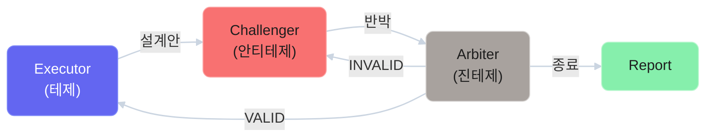
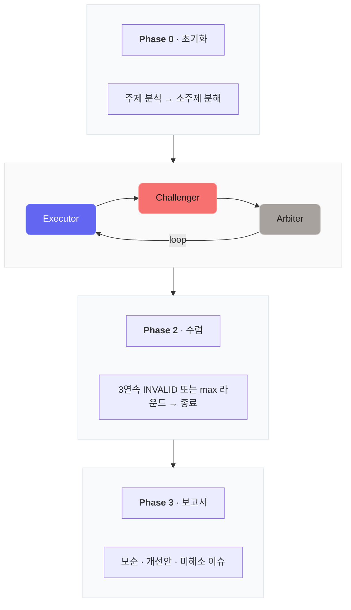

# Multi-Agent Adversarial Verification

> 한국어 | **[English](README.en.md)**


변증법(테제-안티테제-진테제) 구조로 AI 설계를 검증하는 멀티 에이전트 오케스트레이션 시스템

## 이게 뭔가요?

AI한테 "이거 설계해줘"라고 하면 그럴듯한 답이 나옵니다. 근데 **그게 정말 괜찮은 건지** 어떻게 확인하나요?

이 시스템은 역할이 다른 AI 3명을 토론시켜서, 설계의 구멍을 구조적으로 찾아냅니다:



핵심은 **논점 돌리기를 구조적으로 차단**하는 것입니다. 사람 간 토론에서 흔한 논점 흐리기·순환 논증·무근거 수용을 규칙으로 막아, 혼자 설계하면 "이렇게 하면 되겠지"하고 넘어갈 부분을 전부 드러냅니다.

## 왜 필요한가요?

AI가 코드를 빠르게 짜주는 시대에, **사람의 가치는 "빨리 짜는 것"이 아니라 "제대로 판단하는 것"**으로 이동하고 있습니다. 이 시스템은 AI가 벌어준 시간을 **더 많이 만드는 데**가 아니라, **더 좋게 만드는 데** 쓰게 해줍니다.

### 실제 검증 결과

| 실험 | 날짜 | 모델 구성 | 라운드 | 모순 발견 | VALID율 |
|------|------|-----------|--------|----------|---------|
| RAG 시스템 1차 설계 | 04-06 | Claude × 3 | 21 | 47건 | 98% |
| 전광판 영상 동기화 | 04-07 | Claude × 3 | 7 | 42건 | 81% |
| RAG 2차 구현 검증 | 04-08 | Claude / Codex / Gemini | 7 | 40건 | 97.5% |
| RAG 3차 배포 + 런타임 | 04-09 | Claude / Codex / Gemini | 2 + 9 TC | 3건 | 7/9 PASS |
| Blender 3D AI Generator | 04-14 | Claude / Codex / Gemini | 14 | 58건 | 100% |
| PixelForge 코드검증 | 04-14 | Claude / Codex / Gemini | 6 (4R+Meta+Test) | 30건 | VALID 7건 해소 |

> **RAG 설계 검증에서:** 파이프라인 **3회 재설계**, 핵심 데이터 구조 **7회 변경**, 논점 돌리기 **자동 감지·차단** (Executor Collapse 판별 포함)

## 동작 방식



## 설치

### Claude Code 플러그인으로 설치 (권장)

```bash
# 1. 마켓플레이스 추가
/plugin marketplace add cho1124/multi-agent-adversarial-verification

# 2. 플러그인 설치
/plugin install adversarial-verify@adversarial-verification

# 3. 플러그인 새로고침
/reload-plugins
```

### 의존성 (선택)

풀 3모델 구조를 사용하려면:

```bash
# Challenger용 — Codex CLI + 플러그인
npm install -g @openai/codex
/plugin marketplace add openai/codex-plugin-cc
/plugin install codex@openai-codex

# Arbiter용 — Gemini CLI
npm install -g @google/gemini-cli
gemini   # 브라우저에서 Google 로그인
```

Codex/Gemini 없이도 **Claude만으로 사용 가능**:

```bash
/adversarial-verify "주제" --challenger=claude --arbiter=claude
```

## 사용법

```bash
# 기본 (Claude=Executor, Codex=Challenger, Gemini=Arbiter)
/adversarial-verify "실시간 채팅 메시지 저장 전략"

# 역할 자유 배치
/adversarial-verify "DB 스키마" --executor=codex --challenger=claude --arbiter=gemini

# 커스텀 모델 사용 (models/ 폴더에 어댑터 추가)
/adversarial-verify "API 설계" --challenger=ollama-llama --arbiter=claude

# v1 placebo (비교 실험용)
/adversarial-verify "캐싱 전략" --v1

# 최대 라운드 지정
/adversarial-verify "보안 아키텍처" --rounds=20
```

## 커스텀 모델 추가

`plugins/adversarial-verify/models/` 폴더에 어댑터 파일을 추가하면 어떤 모델이든 사용 가능:

```markdown
---
id: ollama-llama
name: Ollama Llama 3.1
type: cli
command: "ollama run llama3.1"
---

# 호출 방법
echo "<프롬프트>" | ollama run llama3.1
```

지원 타입: `session`(Claude 직접), `cli`(터미널 명령어), `api`(HTTP), `mcp`(MCP 서버)

상세: [모델 어댑터 가이드](plugins/adversarial-verify/models/README.md)

---

## 문서

- **[전체 여정 요약](docs/SUMMARY.md)** — 설계→검증→구현→배포 전체 기록

### 설계

- **[멀티 에이전트 적대적 검증 시스템 설계](docs/멀티%20에이전트%20적대적%20검증%20시스템%20설계.md)** — 이론, 설계 원칙, 실험 결과, 메타 검증, 남은 과제

### 실험 기록

- **[RAG 시스템 적대적 검증 (2026-04-06)](docs/experiments/2026-04-06-RAG-시스템-검증/)** — 3소주제, 21라운드, 47건 모순, VALID 98%
  - [청크 ID 안정성](docs/experiments/2026-04-06-RAG-시스템-검증/improvements/01-청크ID-안정성.md) — 7번 재설계
  - [인용 정합성](docs/experiments/2026-04-06-RAG-시스템-검증/improvements/02-인용-정합성.md) — span 3단계 폴백 + 2단계 IoU
  - [캐시 무효화](docs/experiments/2026-04-06-RAG-시스템-검증/improvements/03-캐시-무효화.md) — 3계층 동시 무효화
  - [환각 방지](docs/experiments/2026-04-06-RAG-시스템-검증/improvements/04-환각-방지.md) — sufficiency gate
  - [스트리밍 + 인용](docs/experiments/2026-04-06-RAG-시스템-검증/improvements/05-스트리밍-인용.md) — 문장 버퍼 SSE
  - [레이아웃 보존](docs/experiments/2026-04-06-RAG-시스템-검증/improvements/06-레이아웃-보존.md) — 텍스트+레이아웃 동시 추출
  - [비용 통제](docs/experiments/2026-04-06-RAG-시스템-검증/improvements/07-비용-통제.md) — 로컬 우선 ~$15/월

- **[RAG 시스템 2차 구현 검증 (2026-04-08)](docs/experiments/2026-04-08-RAG-구현-검증/)** — 3모델(Claude/Codex/Gemini), 7라운드, 40건 모순, VALID 97.5%
  - [벡터 차원 불일치](docs/experiments/2026-04-08-RAG-구현-검증/improvements/01-벡터차원-불일치.md) — SQL(384) vs Config(1536) CRITICAL
  - [토큰 추정 결함](docs/experiments/2026-04-08-RAG-구현-검증/improvements/02-토큰추정-결함.md) — ÷3 → tiktoken
  - [Sufficiency Gate](docs/experiments/2026-04-08-RAG-구현-검증/improvements/03-sufficiency-gate.md) — max → 복합 판정 + threshold 분리
  - [캐시 전역 flush](docs/experiments/2026-04-08-RAG-구현-검증/improvements/04-캐시-전역flush.md) — 파이프라인 미연결 + 키 불충분
  - [Prompt Injection](docs/experiments/2026-04-08-RAG-구현-검증/improvements/05-prompt-injection.md) — 입력 sanitize
  - [비용 제로 전환](docs/experiments/2026-04-08-RAG-구현-검증/improvements/06-비용제로-전환.md) — 6 어댑터 + FTS5 + migration
  - [배포 단계화](docs/experiments/2026-04-08-RAG-구현-검증/improvements/07-배포-단계화.md) — single-folder local-first
  - [match_chunks 삭제](docs/experiments/2026-04-08-RAG-구현-검증/improvements/08-match-chunks.md) — v3 DROP 미복원 **(3모델만)**
  - [citation 비강제](docs/experiments/2026-04-08-RAG-구현-검증/improvements/09-citation-비강제.md) — 검증→재생성 로직 부재 **(3모델만)**
  - [라우터 SPOF](docs/experiments/2026-04-08-RAG-구현-검증/improvements/10-라우터-SPOF.md) — JSON fallback + semantic validation **(3모델만)**
  - [캐시 키 정합성](docs/experiments/2026-04-08-RAG-구현-검증/improvements/11-캐시키-정합성.md) — L1/L2/L3 키 불충분 **(3모델만)**
  - [agentic loop 제한](docs/experiments/2026-04-08-RAG-구현-검증/improvements/12-agentic-loop.md) — 1회 왕복 → while loop **(3모델만)**

- **[RAG 3차 배포 검증 + 4차 런타임 검증 (2026-04-09)](docs/experiments/2026-04-09-RAG-배포-검증/)** — 3차: 2라운드, 3건 모순, 미해소 2건 / 4차: 9 TC 자동 실행, 7 PASS, 1 WARN(Llama 8B 인용 미준수)

- **[PixelForge 코드검증 (2026-04-14)](docs/experiments/2026-04-14-PixelForge-Verification/)** — 6라운드(4R+Meta+Test), 30건 모순, VALID 7건 전체 해소, 29개 자동 테스트
  - [모듈 인터페이스 통일](docs/experiments/2026-04-14-PixelForge-Verification/improvements/01-module-interface.md) — postprocess/generator 함수명·시그니처 통일
  - [워크플로우 바이패스](docs/experiments/2026-04-14-PixelForge-Verification/improvements/02-workflow-bypass.md) — IP-Adapter/ControlNet 동적 제거 + 재배선
  - [공유 팔레트](docs/experiments/2026-04-14-PixelForge-Verification/improvements/03-shared-palette.md) — 프레임 간 색상 일관성
  - [API 계약 정직성](docs/experiments/2026-04-14-PixelForge-Verification/improvements/04-api-contract.md) — non-square ValueError (Meta VALID)
  - [Unity 연동](docs/experiments/2026-04-14-PixelForge-Verification/improvements/05-unity-integration.md) — Newtonsoft.Json + padding 좌표
  - [테스트 자동화](docs/experiments/2026-04-14-PixelForge-Verification/improvements/06-test-automation.md) — Mock ComfyUI + E2E + 에러 경로 + 픽셀 검증

- **[전광판 영상 동기화 검증 (2026-04-07)](docs/experiments/2026-04-07-전광판-영상싱크/)** — 7라운드, 42건 모순, VALID 81%, Executor Collapse 감지
  - [단계별 계측](docs/experiments/2026-04-07-전광판-영상싱크/improvements/01-단계별-계측.md) — 290ms 고정 → 5단계 분해
  - [상태머신](docs/experiments/2026-04-07-전광판-영상싱크/improvements/02-상태머신.md) — SYNCED/DRIFTING/DESYNCED 3단계
  - [오차 원인분리](docs/experiments/2026-04-07-전광판-영상싱크/improvements/03-오차-원인분리.md) — 자기상관 분석
  - [UDP 전환](docs/experiments/2026-04-07-전광판-영상싱크/improvements/04-UDP-전환.md) — TCP → UDP 멀티캐스트
  - [자동화](docs/experiments/2026-04-07-전광판-영상싱크/improvements/05-자동화.md) — 수동 파라미터 → 적응형

### 에이전트 정의

- [Executor (테제)](agents/executor.md) — 설계 제안 + 반박 대응
- [Challenger (안티테제)](agents/challenger.md) — 모순 탐색 + Collapse 판별 기준
- [Arbiter (중재)](agents/arbiter.md) — 대칭적 검증 + VALID/WEAK/INVALID 판정
- [Orchestrator (오케스트레이션)](agents/orchestrator.md) — Phase 0~3, 동적 종료

### 모델 어댑터

- [Claude](plugins/adversarial-verify/models/claude.md) — 메인 세션 (기본 Executor)
- [Codex](plugins/adversarial-verify/models/codex.md) — GPT-5.2 CLI (기본 Challenger)
- [Gemini](plugins/adversarial-verify/models/gemini.md) — Gemini 3 Pro CLI (기본 Arbiter)
- [커스텀 모델 추가 가이드](plugins/adversarial-verify/models/README.md)

### 재현성

- [재현성 패키지](experiment/README.md) — 파라미터, 프롬프트 템플릿, 측정 지표
- [실험/문서 작성 가이드](docs/CONTRIBUTING.md) — 새 실험 추가 시 따라야 할 규칙

## 라이선스

MIT License
